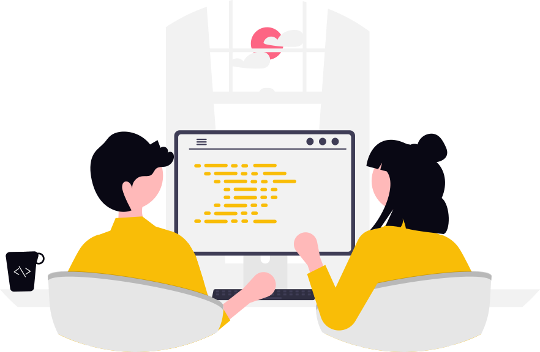
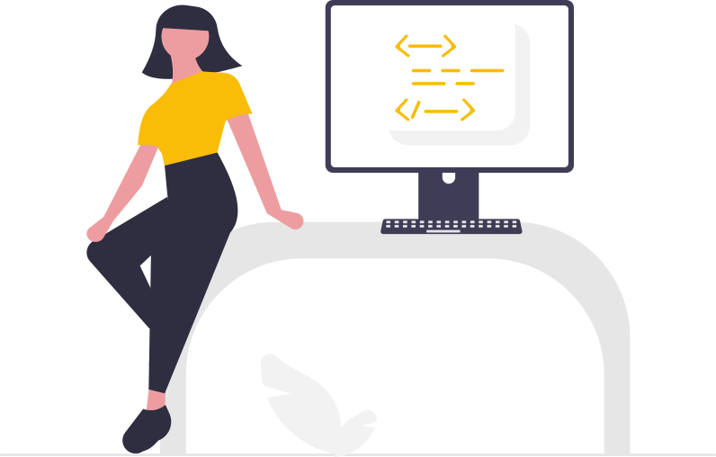

## RAP Drop Ins

:::: {.columns}

::: {.column width="50%"}
- RAP: [Reproducible Analytical Pipelines](https://nhsdigital.github.io/rap-community-of-practice/)
- One hour [online](https://www.smartsurvey.co.uk/s/XPUHSJ) every other Wednesday 10am
- Facilitated by [The Strategy Unit](https://www.strategyunitwm.nhs.uk/)
:::

::: {.column width="40%"}
{fig-alt="Cartoon of a woman at a laptop, man is sat beside." fig-align="right"}
:::

::::

::: {.notes}

- Mention origins of this - used to be hosted by NHSE
- Emphasise that we facilitate - we're not there to answer questions but to encourage discussion
:::

## Who is it for?

- Open to anyone working in the NHS with an interest in RAP
- No coding experience required - managers welcome!
- Discussions [captured on GitHub](https://github.com/The-Strategy-Unit/RAP_Drop_In/discussions) to share learning more widely

::: {.notes}

- Attendance: 10 attendees on average
- Background of attendees very varied - NHS England, CSUs, Trusts, Scientists, Analysts
- We also plan everything using GitHub

:::

## Common themes

- Lots of brilliant individual work happening across the NHS
- Organisational barriers are widespread
- Questions around upskilling
- How to deploy data science products, given limited infrastructure?
- Concerns around safety of data

Can we solve these problems once, for the community?

## Some wins

:::: {.columns}

::: {.column width="50%"}

{fig-alt="A cartoon of two people holding a screen. The screen has a heart."}

:::

::: {.column width="50%"}

- A safe space for people to discuss issues and barriers
- Pulling together use cases
- Making connections with others and working together
- Summary of discussions on GitHub: building a shared community resource

:::

::::

## RAP Code Review Buddies Network

{fig-alt="A cartoon of two people sat at a screen together." fig-align="center"}

:::{.notes}
- Every 3 months, you will be randomly paired up with someone else in the network. 
- As a pair, you will arrange to meet up online and talk through some code you have written. 
- You can then ask each other questions about the code and offer constructive comments.
:::

## Is the network for me?

:::: {.columns}

::: {.column width="50%"}

- Written any code for your job in the last 3 months?

- Any language

- All stages of RAP welcome

- No code review experience needed

- [Guidance is provided](https://github.com/The-Strategy-Unit/RAP_Drop_In/wiki/Code-Review-Buddies-Network#suggested-code-walkthrough-guidelines)

:::

::: {.column width="50%"}

{fig-alt="A cartoon person standing proudly next to a screen"}

:::

::::

## Sounds awesome, how do I sign up?

:::: {.columns}

::: {.column width="50%"}

- RAP drop-in [sign up](https://www.smartsurvey.co.uk/s/XPUHSJ)
- RAP Code Review Buddies Network [sign up](https://forms.microsoft.com/pages/responsepage.aspx?id=slTDN7CF9UeyIge0jXdO40jl8LGcQwpOmLEbW7NDZk9UMFAwNFNTUlFGTzJJOUk4RVFJUEk1SjQ5Ny4u)
- Guidance on our [Wiki on GitHub](https://github.com/The-Strategy-Unit/RAP_Drop_In/wiki/Code-Review-Buddies-Network)
- Get involved 😊

:::

::: {.column width="50%"}

{fig-alt="QR code, which takes you to the signup URL https://forms.microsoft.com/e/eb2vqdJkMB"}
:::

::::
